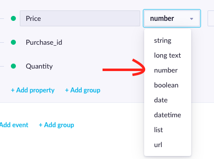
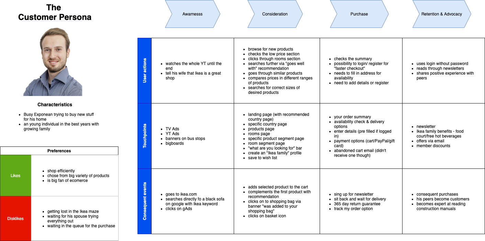

## Tech Consultant Exercise

### Ikea customer tracking
In this exercise I considered https://www.ikea.com/ to be the homepage. I was testing the functionality on UK version of
the site: https://www.ikea.com/gb/en/. I used not always optimal selectors,however the code should be functional, 
given that the jQuery is loaded on the site. <br>
The following code snippet would be added to Ikea's sites together with the JS file:
```html
<script type="text/javascript" src="ikea_tracking.js"></script>

<script>
    //alternatively I could check for Homepage in meta[property='og:title'] or document.title
    if ( window.location.pathname == '/' ){
        track_homepage();
        //product URL no longer contain /product so checking via meta[property='og:type']
    } else if (document.querySelector("meta[property='og:type']").getAttribute('content') == 'product' ){
        track_product();
    } else if (window.location.pathname.includes('shoppingcart')){
        track_shoppingbag();
    } else if (window.location.pathname.includes('search')){
        track_search();
    }
</script>
```
<br>

#### **`ikea_tracking.js`**
```javascript
function track_homepage() {
    console.log("homepage");
}

function track_product() {
    const name = $(".range-revamp-header-section__title--big").first().text();
    const price = parseFloat($(".range-revamp-price__integer").first().text());

    console.log(name);
    console.log(price);
}

function track_shoppingbag(){

    const total_price = parseFloat($(".ordertotal__subtotal-price").first().text().replace(/[^0-9.-]+/g,""));
    //for simplicity I am just checking number of products, however I should also check quantities
    const number_of_products = $(".productlist").children("div").length;
    const avg_price = total_price/number_of_products;

    console.log(number_of_products);
    console.log(avg_price);
}

function track_search(){
    //adding on click action to all add to cart buttons 
    $("button[class*='add-to-cart']").on( "click", function( event ) {
        const product_name = event.currentTarget.parentElement.querySelector('[class*="title--small"]').innerText;
        console.log("added to cart " + product_name);
    });
    //here I use different approach but also jQuerying class="search-summary__heading" would work
    const url_params = new URLSearchParams(window.location.search);
    console.log(url_params.get("q"));
}
```
For testing on the site I was also running this code snippet in the console to be able to use jQuery:
```javascript
    let jq = document.createElement('script');
    jq.src = "https://ajax.googleapis.com/ajax/libs/jquery/3.5.1/jquery.min.js";
    document.getElementsByTagName('head')[0].appendChild(jq);
    // ... give time for script to load, then type (or see below for non wait option)
    jQuery.noConflict();
```

### Purchase_item API tracking

In this example I used Postman to generate the cURL code (a bit different syntax when compared to cURL generated on our
docs). For correct authorisation one would have to make sure the API group in Exponea has permissions to set events of
type purchase_item (the API_KEY in this example represents the base 64 encoding of a user ID and password of the
aforementioned API group's key). Also, I believe the type Number and Integer are not distinct in this case as Exponea Backend doesn't
differ the type between a floating-point number and integer:


#### **`purchase_item_API.sh`**
```shell script
curl --location --request POST 'https://api.exponea.com/track/v2/projects/d7809db4-3909-11e9-9a0e-0a580a202e2c/customers/events' \
--header 'Content-Type: application/json' \
--header 'Authorization: Basic API_KEY' \
--data-raw '{
    "customer_ids": {"cookie": "ac568a0e-1919-4fe0-86b4-5a1db14a8284"},
    "properties": {
        "Item_id": "item_1",
        "Item_name": "some_name",
        "Price": 100.12,
        "Quantity": 1,
        "Purchase_id": "purchase_1234",
        "Item_on_sale": true
    },
    "event_type": "purchase_item"
}'
```

### Ikea Add to Shopping bag button AB test

Here I will demonstrate the use case using pseudo-code. The cookie would be set with its maxAge parameter to distant 
future, to ensure the code works - unless the customer deletes his cookies.<br>
#### **`pseudo_AB_test.js`**
```
check if ab_test_cookie is present in user browser
    //true branch
    check if ab_test cookie == yellow
        get the buttons and change its color to yellow
    else
       do nothing
else
    // false branch
    set xfactor = random betwen 0 and 1
    if xfactor % 2 == 0
        //true branch 
        leave the buttons as they are
        set the ab_test_cookie = original
    else
        //false branch
        get the buttons and change its color to yellow
        set the ab_test_cookie =  ab_test_cookie=yellow
```


### Flow mapping: customer journey map Ikea.com
The goal of this map is to understand better the experience of the customers shopping on Ikea's sites remove paint points
and propose improvements (I will leave the evaluation out, but I just wanted to set some reasonable goal).
In this exercise I decided to select a customer persona that is likely to shop Ikea's products online (made this up). 
For a sake of simplicity (and not being part of ecommerce Ikea's team) I made up some entry points to
the site, but I believe they might represent the reality. I excluded the pain points and emotions sections of the
map for simplicity as it was not a requirement of the exercise. However, I believe those are actually important sections,
which will let us to come to some actionable changes. From my point of view, for example the registered user, 
doesn't have enough friction removed in the order process (etc). 

#### Customer Journey Map
